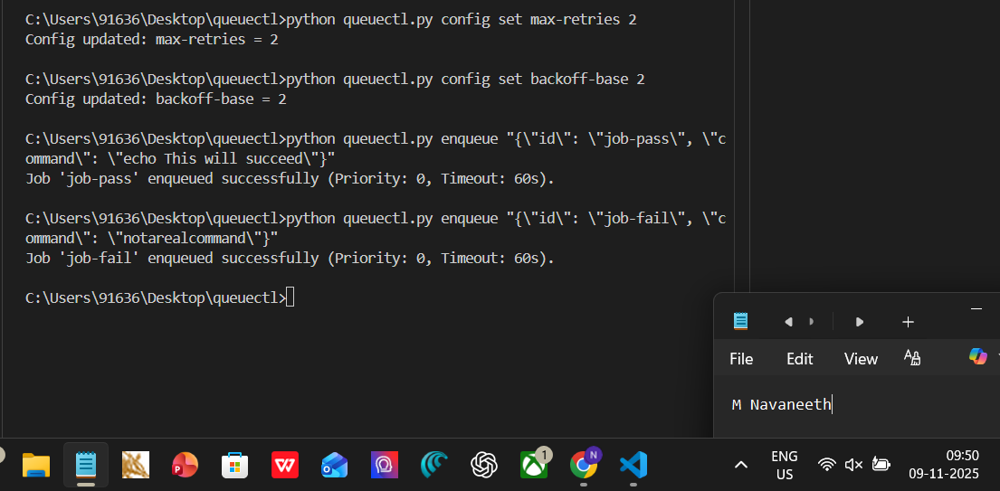
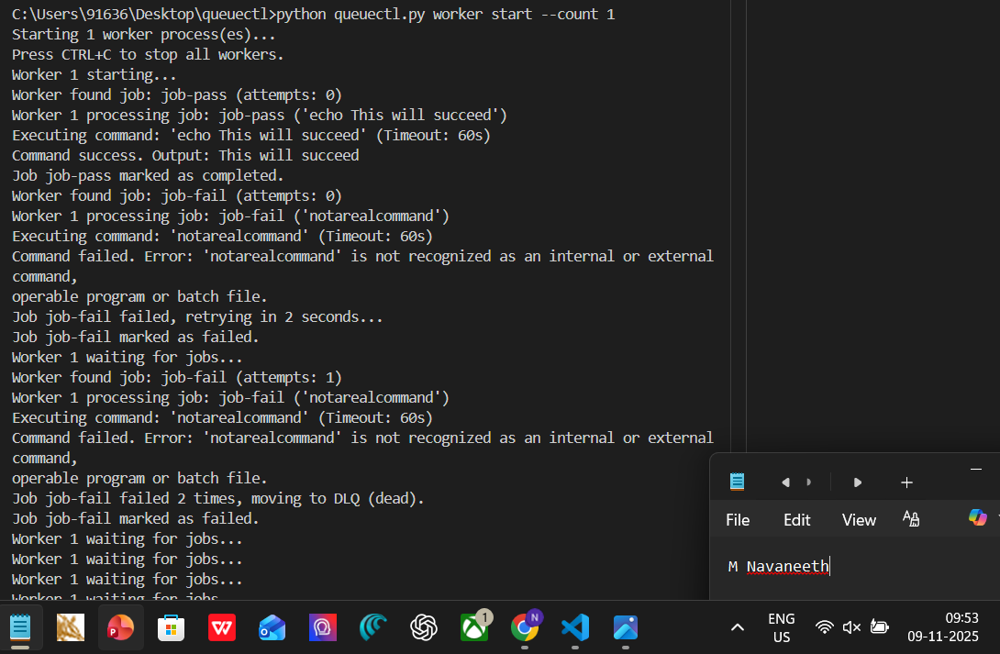
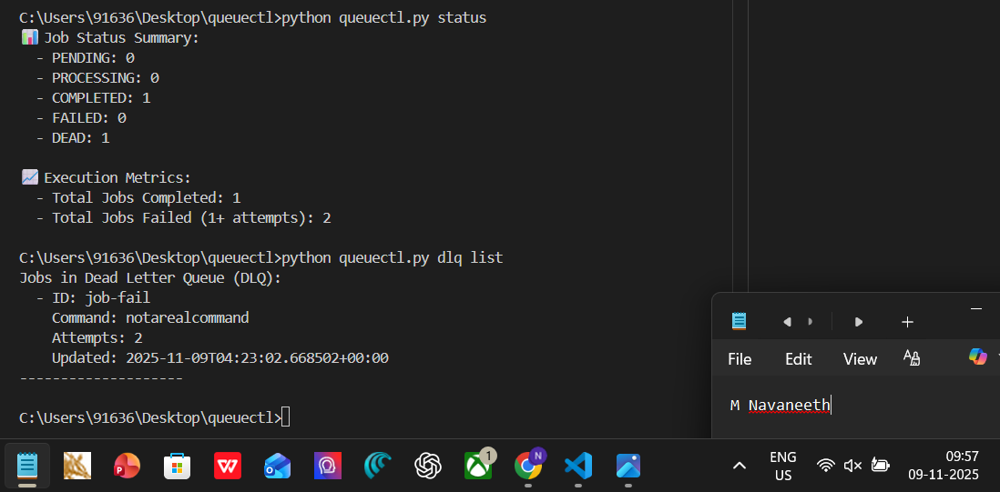
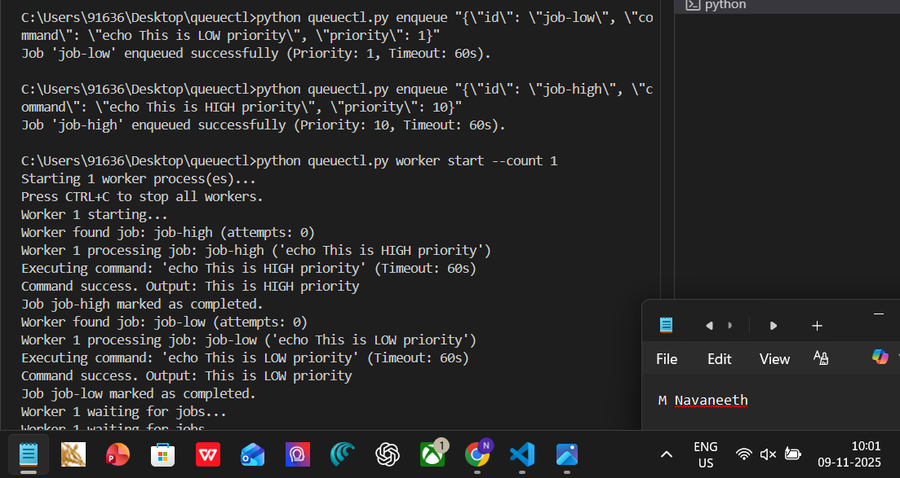
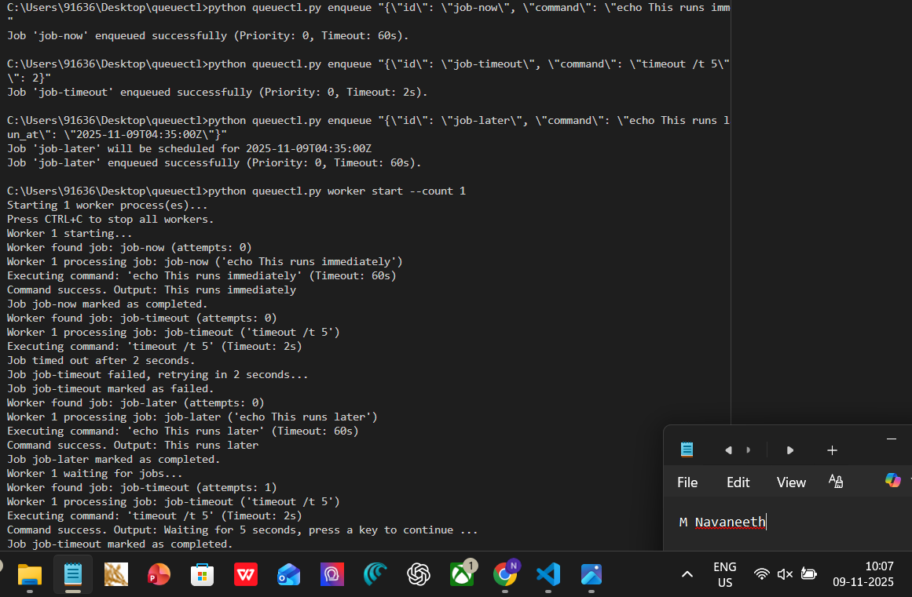
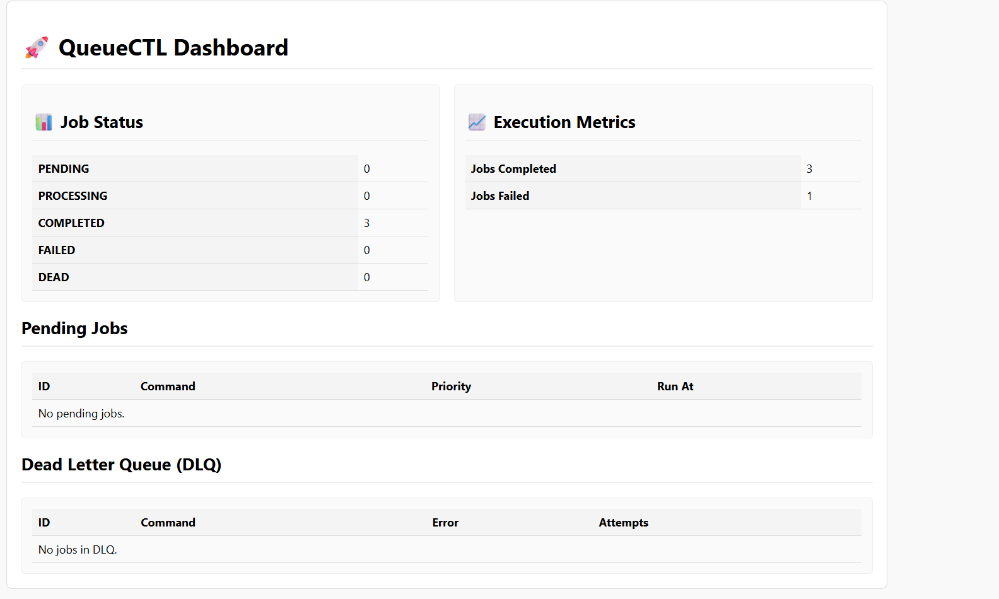

# 🚀 QueueCTL: A Resilient CLI Job Queue System

**[➡️ Click Here for the Live CLI Demo Video](https.drive.google.com/file/d/1cUV3p64_2HJMT_wZpkKYdxKvlDQyz9lY/view?usp=drive_link)**
This repository contains a complete, end-to-end background job queue system named `queuectl`. The objective is to build and demonstrate a production-grade, CLI-based tool capable of managing parallel background jobs, handling failures with retries, and providing robust monitoring.

The project follows a complete backend engineering workflow, from initial architecture and persistence design to concurrent worker implementation, configuration management, and a final web dashboard for monitoring.

---

## ✅ Feature Checklist

| Category | Feature | Status |
| :--- | :--- | :--- |
| **Mandatory** | **Working CLI Application** | ✅ **Complete** |
| Mandatory | **Persistent Job Storage** (SQLite) | ✅ **Complete** |
| Mandatory | **Multiple Worker Support** (Parallel) | ✅ **Complete** |
| Mandatory | **Retry & Exponential Backoff** | ✅ **Complete** |
| Mandatory | **Dead Letter Queue (DLQ)** | ✅ **Complete** |
| Mandatory | **Configuration Management** (CLI) | ✅ **Complete** |
| **Bonus** | **Job Timeout Handling** | ✅ **Complete** |
| **Bonus** | **Job Priority Queues** | ✅ **Complete** |
| **Bonus** | **Scheduled/Delayed Jobs (`run_at`)** | ✅ **Complete** |
| **Bonus** | **Job Output Logging** (stdout/stderr) | ✅ **Complete** |
| **Bonus** | **Metrics & Execution Stats** | ✅ **Complete** |
| **Bonus** | **Minimal Web Dashboard** | ✅ **Complete** |

---

## 🛠️ Technology Stack & Environment

* **Environment:** Python 3.7+ (with `venv`)
* **Language:** Python
* **Core Libraries:**
    * **Click:** For building a clean, powerful, and discoverable CLI interface.
    * **SQLite (`sqlite3`):** As the persistent storage layer. Chosen for its transactional support, which is critical for concurrency.
    * **Multiprocessing:** For running multiple worker processes in true parallel to maximize throughput.
    * **Flask:** For the (bonus) minimal web dashboard.

---

## ⚙️ Methodology & Architecture

The project was executed following a structured backend design process.

1.  **Persistent Storage (Database):**
    * The system is built on a **SQLite** database (`queue.db`) to ensure job data persists across restarts.
    * SQLite was chosen over a simple JSON file because it provides built-in transactions and row-level locking. This is **essential** for the "Multiple Worker" requirement, as it natively prevents race conditions.
    * The database includes tables for `jobs`, `config`, and `metrics`.

2.  **Job Lifecycle & States:**
    * A job progresses through a well-defined lifecycle:
    * `pending` → `processing` → `completed`
    * `pending` → `processing` → `failed` (if retriable)
    * `failed` → `processing` → `dead` (if retries exhausted)
    * This entire flow is managed by the worker and stored in the database.

3.  **Concurrency & Worker Management:**
    * The `queuectl worker start --count N` command uses Python's `multiprocessing` module to launch `N` independent worker processes.
    * **Concurrency is safely handled** using an atomic SQL query. Workers do not "ask" for a job and then "lock" it (which creates a race condition). Instead, they execute a single atomic `UPDATE ... LIMIT 1 ... RETURNING` query. This finds, locks, and marks the next available job as `processing` in one indivisible operation, guaranteeing no two workers can grab the same job.

4.  **Retry, Backoff, and DLQ Logic:**
    * When a job fails, the system logs the error and increments an `attempts` counter.
    * It then calculates the next retry time using **exponential backoff** (`delay = backoff_base ^ attempts`). The `backoff_base` is configurable via the CLI.
    * If `attempts` exceeds the configurable `max_retries`, the job's state is set to `dead` and it is moved to the **Dead Letter Queue (DLQ)** for manual inspection.

5.  **Bonus Feature Implementation:**
    * The core architecture was extended to support all bonus features.
    * **Priority/Scheduled:** The worker's SQL query was modified to `ORDER BY priority DESC, created_at ASC` and to only select jobs where `run_at` is in the past.
    * **Timeout:** The `execute_job` function passes a `timeout` parameter to the `subprocess.run()` call.
    * **Logging/Metrics:** The database functions were updated to write to `output`/`error` columns and increment counters in the `metrics` table upon job completion or failure.

6.  **Monitoring (CLI & Web):**
    * All operations are accessible via the `queuectl` CLI.
    * A final (bonus) Flask dashboard (`dashboard.py`) was added to provide a simple, read-only web interface for monitoring queue status and metrics in real-time.

---

## 📸 Feature Showcase (Screenshots)

The following screenshots document the key features of the system in action.

### 1. Config, Enqueue, and Status (Mandatory)
Setting configuration (`max-retries`) and enqueuing a successful (`job-pass`) and a failing (`job-fail`) job.

### 2. Worker, Retry, and DLQ (Mandatory)
A single worker processing the jobs. `job-pass` succeeds. `job-fail` fails, retries with the correct 2-second backoff, and is then moved to the `DEAD` state (DLQ) after exhausting its 2 retries.

### 3. DLQ List and Job Output (Mandatory & Bonus)
Using `dlq list` to inspect the Dead Letter Queue. This also demonstrates the **Job Output Logging** feature, as the `Error` for the job is correctly saved and displayed.

### 4. Job Priority (Bonus)
The worker correctly processes `job-high` (priority 10) *before* `job-low` (priority 1), even though `job-low` was enqueued first.

### 5. Scheduled Jobs & Timeout (Bonus)
This test proves two features:
1.  **Job Timeout:** `job-timeout` is killed after 2s, logs "Job timed out..." and is marked as failed.
2.  **Scheduled Job:** `job-later` is ignored by the worker until its `run_at` time is reached, at which point it is picked up and executed.

### 6. Web Dashboard & Metrics (Bonus)
The minimal web dashboard at `http://127.0.0.1:5000` showing the final state of the queue and the **Execution Metrics**, which correctly tracked the total completed and failed jobs from the test run.

